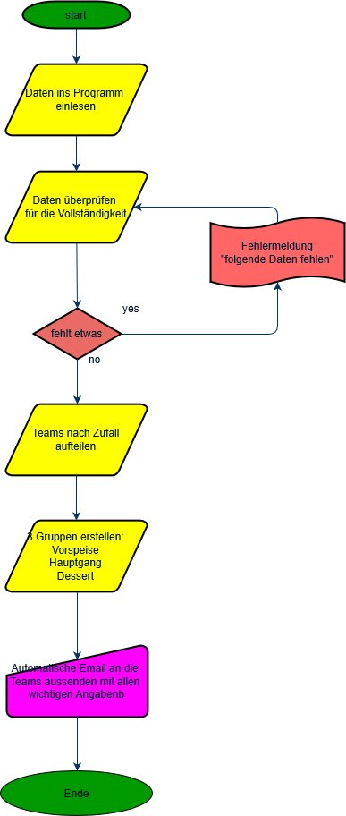

# Abstract

Das Projekt während dem Modul Programmieren2 beinhaltet eine Webapplikation mit python und html zu programmieren. Dabei ist nicht nur das Projekt entscheidend sondern auch die ständige Entwicklung und die Kommentare.

# Meine Projektidee

## Running Dinner für die Studentenschaft

Das Programm soll mir ermöglichen die Einteilung fürs Running Dinner zu erleichtern. Dabei sollen Daten von zwei Personen, welche ein Team bilden eingelesen werden. Daten wie Name, Adresse, Telefonnummer und Studiengang. Danach soll das Programm die Teams dreimal aufteilen für Vorspeise, Hauptspeise und Dessert. Dass soll nacher angezeigt werden und als Excel Dokument heruntergeladen werden können.

# Anforderungen

- Excel Dokument einlesen
- Teams in 3er Gruppen einteilen (je für Vorspeise, Hauptspeise und Dessert)
- Gruppen ausgeben

## Flussdiagramm

