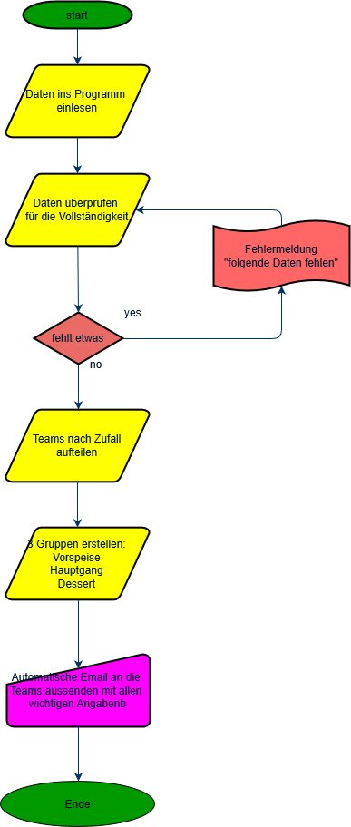

# Meine Projektidee

## Running Dinner für die Studentenschaft

Das Programm soll mir ermöglichen die Einteilung fürs Running Dinner zu erleichtern. Dabei sollen Daten von zwei Personen, welche ein Team bilden eingelesen werden. Daten wie Name, Adresse, Telefonnummer und Studiengang. Danach soll das Programm die Teams dreimal aufteilen für Vorspeise, Hauptspeise und Dessert. Dabei soll das Programm darauf achten, dass die Personen nicht zweimal an den gleichen Ort gehen. Zusätzlich wäre es super wenn die Adressen abgeglichen werden können damit nicht Personen in die eigene WG gehen.

## Flussdiagramm

